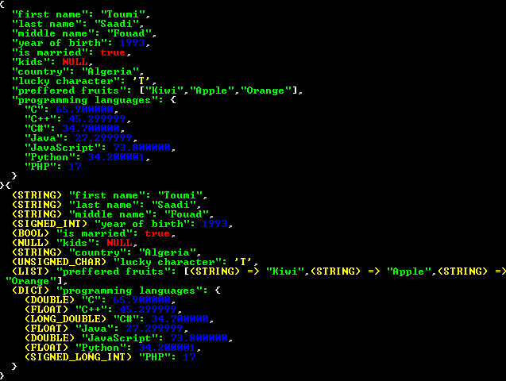

# C Dictionaries & Lists

## Introduction

This is a single linked list of structs library for creating and manipulating dictionaries and lists in **c**

## Usage

Include the `c_dicts_n_lists.h` header file
```c
#include "c_dicts_n_lists.h"
```
Create for example a file `test.c`, then create some dicts and lists and add some data (multi types supported)

**test.c**
```c
#include "c_dicts_n_lists.h"

int main() {
  DICT *person = DICT_CREATE(); // create a new empty dict
  LIST *prefferedFruits = LIST_CREATE(); // create a new empty list
  DICT *programmingLanguages = DICT_CREATE();

  LIST_ADD(prefferedFruits, "Kiwi"); // add a value
  LIST_ADD(prefferedFruits, "Mango");
  LIST_ADD(prefferedFruits, "Orange");
  DICT_ADD(person, "first name", "Toumi"); // add a key, value pair
  DICT_ADD(person, "last name", "Saadi");
  DICT_ADD(person, "middle name", "Fouad");
  DICT_ADD(person, "year of birth", 1993); 
  DICT_ADD(person, "is married", true);
  DICT_ADD(person, "kids", NULL);
  DICT_ADD(person, "country", "Algeria");
  DICT_ADD(person, "lucky character", 'T');
  DICT_ADD(person, "preffered fruits", prefferedFruits); 
  DICT_ADD(person, "programming languages", programmingLanguages); 
  DICT_ADD(programmingLanguages, "C", 65.9);
  DICT_ADD(programmingLanguages, "C++", 45.3f);
  DICT_ADD(programmingLanguages, "C#", 34.7L);
  DICT_ADD(programmingLanguages, "Java", 27.3f);
  DICT_ADD(programmingLanguages, "JavaScript", 73.8);
  DICT_ADD(programmingLanguages, "Python", 34.2f);
  DICT_ADD(programmingLanguages, "PHP", 17l);
  LIST_UPDATE(prefferedFruits, 1, "Apple"); // update the second item in the list
  DICT_PRINT(person); // print the content of the dict
  DICT_PRINTD(person); // print the content of the dict plus each value type
  DICT_DELETE(person); // clear the items and free the dict memory
  return 0;
}
```

Compile and link for example using **gcc**:
```
gcc -c c_dicts_n_lists.c -o c_dicts_n_lists.o
gcc test.c -o test c_dicts_n_lists.o 
```

Run the executable so you get the output



## Supported types as values:
```txt
NULL,
BOOL,
UNSIGNED_CHAR,
SIGNED_CHAR,
UNSIGNED_SHORT_INT,
UNSIGNED_INT,
UNSIGNED_LONG_INT,
UNSIGNED_LONG_LONG_INT,
SIGNED_SHORT_INT,
SIGNED_INT,
SIGNED_LONG_INT,
SIGNED_LONG_LONG_INT,
FLOAT,
DOUBLE,
LONG_DOUBLE,
STRING,
DICT,
LIST
```

## Implementation:
* **Dict**
```c
////////////////////////////////////////////////////////////////////////////////
/// \brief dict class(linked list of items) with the first and
/// last item as `start`, `end` and the number of items as `size`
///
////////////////////////////////////////////////////////////////////////////////
typedef struct {
  DICT_ITEM *start;
  DICT_ITEM *end;
  int size;
} DICT;
```
* **List**
```c
////////////////////////////////////////////////////////////////////////////////
/// \brief list class(linked list of items) with the first and
/// last item as `start`, `end` and the number of items as `size`
///
////////////////////////////////////////////////////////////////////////////////
typedef struct {
  LIST_ITEM *start;
  LIST_ITEM *end;
  int size;
} LIST;
```
* **Dict Item**(key value pairs)
```c
////////////////////////////////////////////////////////////////////////////////
/// \brief item class holds the `type` of the item, the `value`, the property
/// name as `key` and the address of the next pair as (KV)
///
////////////////////////////////////////////////////////////////////////////////
typedef struct DICT_ITEM {
  VALUE_TYPE type;
  char *key;
  void *value;
  struct DICT_ITEM *next;
} DICT_ITEM;
```
* **List Item**
```c
////////////////////////////////////////////////////////////////////////////////
/// \brief item class holds the `type` of the item, the `value` and the address 
/// of the next pair as (LIST_ITEM)
///
////////////////////////////////////////////////////////////////////////////////
typedef struct LIST_ITEM {
  VALUE_TYPE type;
  void *value;
  struct LIST_ITEM *next;
} LIST_ITEM;
```
## Documentation

For more infos checkout the **[Wiki](https://github.com/Tommy-LifeLongLearner/c_dicts_n_lists/wiki)** 